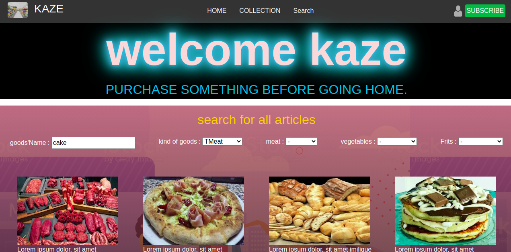

# Goods-e-shop
This project is a model of e-shop food. It is based on the prototype made by [Mohammed Awad on Behance](https://www.behance.net/M_Awad).

Capstone project solo. it's an Html project built at the end of the first of  Main Technical Curriculum sections. The project consists of building a website of a shop of foods; he is built with 2 pages, main page(index.html), and the page of the results of the search(searched.html). it is done with HTML, CSS, and bootstrap, using Positioning and Layout (Including Grid and Flexbox), and Media Query. 2 Pages completely responsive!

**An e-shop website built for Kaze shop**


## This is a clone application of GOODS-SHOP.

 
<br />
<p align="center">
   <h3 align="center">GOODS-SHOP</h3>

  <p align="center">
    A simple clone of the The GOODS-SHOP Page.
    <br /> 
    <a href="https://www.loom.com/share/1cfdb4d252f748bea4ea80cfd2e9bf49"> project's description</a>   
    <br />
    ·
     <a href="https://raw.githack.com/Guy-Gustave/goods-shop/feature-branch/index.html"> Live Demo</a>
    ·    
  </p>
</p>

<!-- TABLE OF CONTENTS -->
## Table of Contents

* [About the Project](#about-the-project)
* [getting started](#getting_started)
* [Built With](#built-with)
* [Contact](#contact)
* [Acknowledgements](#acknowledgements)


<!-- ABOUT THE PROJECT -->
## About The Project

  I am  Gustave. I am part of the Microverse Program and I did this capstone project according to the required specifications, typography and color. 

## Getting started
**For this project, I tried our best to recreate the online shop page. The main aim is to ensure the elements get placed and styled roughly the same way using responsive bootstrap as required.**

To get a local copy of the repository please run the following commands on your terminal:
```
$ cd <folder>
```
```
$ git clone git@github.com:Guy-Gustave/goods-shop.git
```
```
$ cd to move into the downloaded folder
```
```
drag and drop the index file into the browser
```
  


### Build With

* [Html]()
* [CSS]()
* [BOOTSTRAP]()


### Contact
* Gustave 
- [twitter](https://twitter.com/GuyNigaba)  
- [LinkedIn](https://www.linkedin.com/in/guy-gustave-nigaba-7988ba181/) 
- [GitHub](https://github.com/Guy-Gustave/)

## Contributing
Contributions, issues, and feature requests are welcome!

   1. Fork the Project
   2. Create your Feature Branch (git checkout -b feature/AmazingFeature)
   3. Commit your changes (git commit -m 'Add some AmazingFeature')
   4. Push to the Branch (git push origin feature/AmazingFeature)
   5. Open a Pull Request

## Show your support
Give a :étoile:️ if you like this project!

### Acknowledgements

* [GitHub](https://github.com)
* [Microverse](https://www.microverse.org/)
* [The Odin Project](https://www.theodinproject.com/courses/html5-and-css3/lessons/)
* [StyleLint]()
* [Stickler]()
