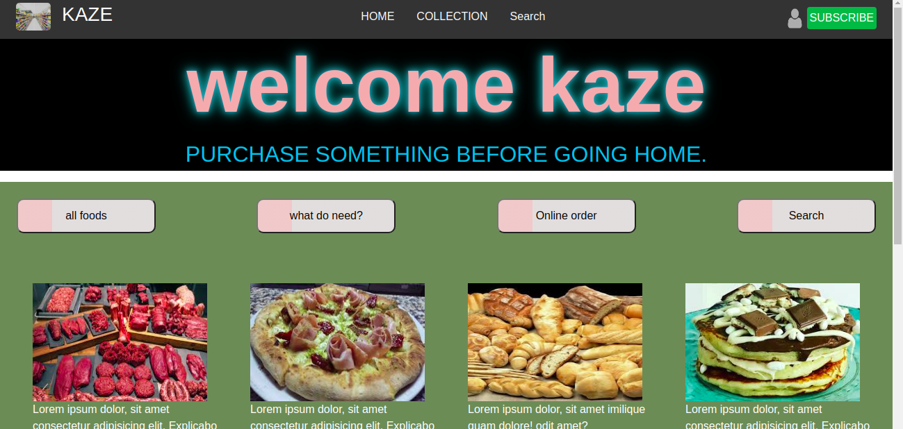

# Goods-e-shop
Capstone project solo, html project built at the end of the first of  Main Technical Curriculum sections. 

## This is a clone application of GOODS-SHOP.
 
 
 
 

   <h3 align="center">GOODS-SHOP</h3>

  

    A simple clone of the The GOODS-SHOP Page.
         
     
    ·
     <a href="https://raw.githack.com/Guy-Gustave/goods-shop/feature-branch/index.html ">Live Demo</a>
    ·    
  

<!-- TABLE OF CONTENTS -->
## Table of Contents

* [About the Project](#about-the-project)
* [getting started](#getting_started)
* [Built With](#built-with)
* [Contact](#contact)
* [Acknowledgements](#acknowledgements)

<!-- ABOUT THE PROJECT -->
## About The Project

  I am Gustave. I am part of the Microverse Program and I did this capstone project according to the required specifications.  

## Getting started
**For this project, I tried our best to recreate the a online shop page. The main aim is to ensure the elements get placed and styled roughly the same way using responsive  booststrap as required.**

We built our own page in a .html text file and opened it in our browser to check it out. We carried out the following steps:
  - First setup a github repository for the project.
  - Then create a .html file where all our HTML markup will go
  - Create a .css file where some elements of our styling code will reside
  

### Build With

* [Html]()
* [CSS]()
* [BOOTSTRAP]()

### Contact
* Gustave 
- [@GuyNigaba](https://twitter.com/GuyNigaba)  
- [LinkedIn](https://www.linkedin.com/in/guy-gustave-nigaba-7988ba181/) 
- [GitHub](https://github.com/Guy-Gustave/)

## Contributing
Contributions, issues and feature requests are welcome!

   1. Fork the Project
   2. Create your Feature Branch (git checkout -b feature/AmazingFeature)
   3. Commit your Changes (git commit -m 'Add some AmazingFeature')
   4. Push to the Branch (git push origin feature/AmazingFeature)
   5. Open a Pull Request

### Acknowledgements

* [GitHub](https://github.com)
* [Microverse](https://www.microverse.org/)
* [The Odin Project](https://www.theodinproject.com/courses/html5-and-css3/lessons/)
* [StyleLint]()
* [Stickler]()
